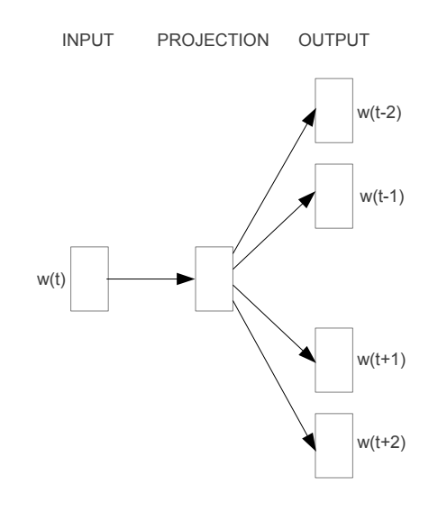
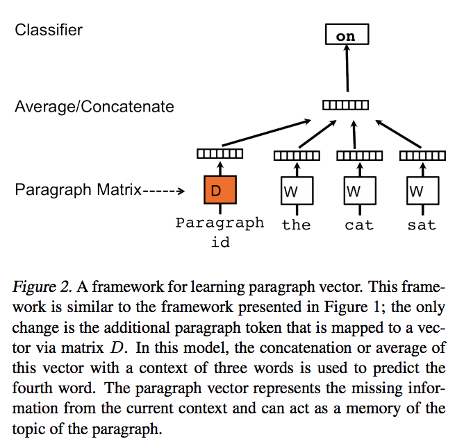

# Text representation

Text representation is one of the fundamental problems in text mining and Information Retrieval (IR).
It aims to numerically represent the unstructured text documents or words to make them mathematically computable. 
There are some popular technology to get text representation, such as doc2vec, word2vec and glove.

# Word2vec

This task implement a novel model architectures for computing continuous vector representations of words from very large data sets.
The quality of these representations is measured in a word similarity task, and the results are compared to the previously
best performing techniques based on different types of neural networks.

The framework are following:



```
cd nlp/text_representation/word2vec

build vocab：python vocab.py \
        --train_dir train \
        --data_file data.txt \
        --min_count=5

train：python word2vec.py \
        --train_dir train \
        --save_path embedding_path \
        --epochs_to_train 10 \
        --min_count 5 \
        ......
```

# Glove

In this task, We implement a specific weighted least squares model that trains on global word-word co-occurrence counts and thus makes efficient use of statistics.

you can use the following to run:

```
bazel build nlp/text_representation/glove:run

bazel-bin/nlp/text_representation/glove/run \
        --data_dir data \
        --log_dir log_dir \
        --result_file result \
        --num_epochs 100 \
        --min_occurrences 1 \
        ......
```

you can check run.py file to know special information.

# Doc2vec

In this task, we implement Paragraph Vector, an unsupervised algorithm that learns fixed-length feature representations from variable-length pieces of texts, such as
sentences, paragraphs, and documents. This algorithm represents each document by a dense vector which is trained to predict words in the document.
Its construction gives our algorithm the potential to overcome the weaknesses of bag-ofwords models.

The framework are following:



you can use the following to run:

```
bazel build nlp/text_representation/doc2vec:run

bazel-bin/nlp/text_representation/doc2vec/run \
        --train_dir train \
        --data_file embedding_path \
        --n_steps 10 \
        --min_count 5 \
        ......
```
you can check run.py file to know special information.

# Reference

- [Efficient Estimation of Word Representations in Vector Space](https://arxiv.org/pdf/1301.3781.pdf)
- [GloVe: Global Vectors for Word Representation](https://nlp.stanford.edu/projects/glove/)
- [Distributed Representations of Sentences and Documents](https://arxiv.org/pdf/1405.4053.pdf)
